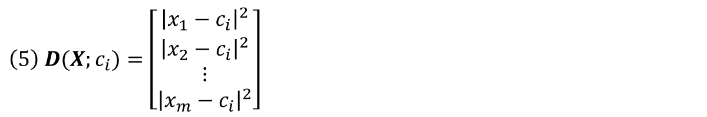
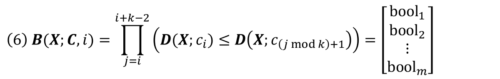
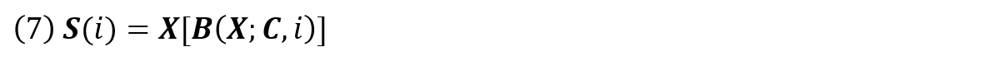

# Naive K-Means Clustering

<p align="justify">
    This is a module for the repeated k-means clustering method for pattern recognition and classification of data written in Python.
</p>
<p align="left">
    
</p>
<h1>Mathematics</h1>
<p align="justify">
    In the k-means module, the data to be classified is stored as a matrix <i><b>X</b></i> (1), 
    in which each row <i>x<sub>i</sub></i> is an <i>n</i>-dimensional data point and <i>m</i> is the number of data points.
</p>
<hr>
<p align="center">
    
</p>
<hr>
<p align="justify">
    K-means classification tries to find the center of each cluster, which is called a centroid.
    The centroids are stored as a separate matrix <i><b>C</b></i> (2),
    in which each row <i>c<sub>i</sub></i> is an <i>n</i>-dimensional centroid and <i>k</i> is the number of centroids.
</p>
<hr>
<p align="center">
    
</p>
<hr>
<p align="justify">
    The <i>k</i> centroids are used to identify <i>k</i> clusters in the data.
    Each data point is classified according to its squared distance from each centroid.
    The centroid with the minimum squared distance is the cluster the data point belongs to.
    Formally, a data point <i>x<sub>h</sub></i> is part of the set <i>s<sub>i</sub></i> if the squared distance between <i>x<sub>h</sub></i>
    and the centroid <i>c<sub>i</sub></i> is the less than or equal to the squared distance between <i>x<sub>h</sub></i> and all other centroids.
    This is described using set-builder notation in (3). If the smallest squared distance is equal between two or more centroids, 
    the data point <i>x<sub>h</sub></i> will be classifed into two or more sets.
</p>
<hr>
<p align="center">
    
</p>
<hr>
<p align="justify">
    The sum of squared distances is the sum of squared error <i>SSE</i> (4), 
    where <i>x<sub>h</sub></i> is a data point in the set <i>s<sub>i</sub></i> that belongs to the <i>i<sup>th</sup></i> cluster having a centroid at <i>c<sub>i</sub></i>.
    The <i>SSE</i> should be at a minimum value when all centroids are at there optimal locations.
</p>
<hr>
<p align="center">
    
</p>
<hr>
<p align="justify">
    To simplify the mathematical notation, 
    a matrix containing all the squared distances of each data point in <i><b>X</b></i> from the <i>i<sup>th</sup></i> centroid <i>c<sub>i</sub></i> is defined in (5).
</p>
<hr>
<p align="center">
    
</p>
<hr>
<p align="justify">
    The following boolean operation (6), where the less than or equal to operation is applied element-wise, 
    creates a column matrix in which all data points that belong to the <i>i<sup>th</sup></i> centroid <i>c<sub>i</sub></i> 
    will result in a true value and false otherwise.
</p>
<hr>
<p align="center">
    
</p>
<hr>
<p align="justify">
    Using NumPy, the resulting boolean matrix can be used to index the data in <i><b>X</b></i>. 
    The indexed data contains all the data points that belong to the set <i>s<sub>i</sub></i> (7).
</p>
<hr>
<p align="center">
    
</p>
<hr>
<p align="justify">
    The location of the <i>i<sup>th</sup></i> centroid <i>c<sub>i</sub></i> is then updated in (8),
    which is the mean of each component in the indexed data.
</p>
<hr>
<p align="center">
    
</p>
<hr>
<h1>Algorithm</h1>
<p align="justify">
    The algorithm for the k-means module is shown below. 
    The location of each centroid is initialized as a random data point in <i><b>X</b></i>.
    The matrix <i><b>C</b><sub>prev</sub></i> is initialized as an empty matrix.
    When the location of each centroid is not changed, 
    when the previous matrix <i><b>C</b><sub>prev</sub></i> equals the current matrix <i><b>C</b></i>,
    the algorithm completes and then the <i>SSE</i> is calculated.
</p>
<hr>
<p align="center">
    
</p>
<hr>
<h1>Example</h1>
<p align="justify">
    The data found in "clusters.csv" is plotted below. 
    It contains synthetic 2-dimensional data having 15 clusters. 
    The dots represent each data point.
</p>
<hr>
<p align="center">
    
</p>
<hr>
<p align="justify">
    The result of the algorithm is shown below. The black circles show the locations of the centroids.
    Each cluster is color coded. Lines connect the data points to the centroid they are closest to.
    The algorithm failed to locate all of the clusters. Some centroids appear in between clusters.
    Others appear within the same cluster. This is a drawback of the k-means clustering method.
    It found stable clustering centers that are not optimal.
    The final locations of the centroids depend on how the they are initiated.
</p>
<hr>
<p align="center">
    
</p>
<hr>
<p align="justify">
    Running the algorithm 100 times, initiating the centroids each time, and selecting the centroids which produce the smallest <i>SSE</i>,
    produces the plot below. This is called repeated k-means clustering. 
    Since the centroids are initialized randomly, given a number of attempts, the optimal initiation will eventually be found.
    All of the clusters and centroids found are optimal.
    However, a few points near the oblong cluster on the lower right of the plot are classified incorrectly.
    This is another drawback to k-means clustering. The k-means model places a circle a hyper-sphere at the center of each cluster, 
    with a radius defined by the most distant point in the cluster.
    This means it does not account for the covariance or shape of the cluster.
    For a detailed description of the pros and cons of k-mean clustering, 
    refer to <a href="https://www.sciencedirect.com/science/article/pii/S0031320319301608">This Recourse</a>.
</p>
<hr>
<p align="center">
    
</p>
<hr>

<h1>Try It</h1>

<p align="justify">
    Importing the k-means module and reading the "clusters.csv" file.
</p>

```python
from kmeans import KMeans
import pandas as pd, numpy as np
```

```python
df = pd.read_csv( 'clusters.csv' )
```

<p align="justify">
    Converting the data into a matrix, setting <i>k</i> to 15 and repeating the classification 100 times.
</p>

```python
X = df.to_numpy() / 100000
kmeans = KMeans( X, 15 )
kmeans.classify( repeat = 100 )
```

<p align="justify">
    Sorting the centroids found by the k-means module and reading and sorting the contents of the file "centroids.csv,"
    which contains the actual locations of each centroid.
</p>

```python
kmeans.C = np.sort( kmeans.C, axis = 0 ).round( 5 )
truth = pd.read_csv( 'centroids.csv', header = None ).to_numpy() / 100000
truth = np.sort( truth, axis = 0 )
```

<p align="justify">
    Creating a dataframe to compare the computed centroid locations with their actual locations.
</p>


```python
table = pd.DataFrame(
    {
        'Centroid' : [ '1', '2', '3', '4', '5', 
                       '6', '7', '8', '9', '10', 
                       '11', '12', '13', '14', '15'],
        'K-Means X' : kmeans.C[ :, 0 ],
        'True X'    : truth[ :, 0 ],
        'K-Means Y' : kmeans.C[ :, 1 ],
        'True Y'    : truth[ :, 1 ]
    }
)
```

<p align="justify">
    Creating a table with help from the "table.py" module.
</p>

```python
from table import render_table
import matplotlib.pyplot as plt

render_table( 
    table, header_columns = 0, col_width = 2.0, font_size = 15,
    title = 'Coordinates of K-Means Computed Centroids vs. Ground Truth Centroids' 
)
plt.show()
```

<p align="justify">
    Comparing the centroid locations computed from the repeated k-means clustering module with their true locations.
    The computed locations are very close to the actual values.
</p>

<p align="center">
    
</p>
